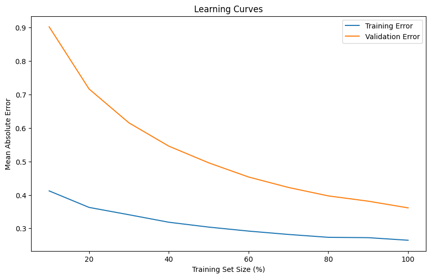

# AIS Vessel Trajectory Prediction

## Introduction
The AIS Vessel Trajectory Prediction project leverages Automatic Identification System (AIS) data to forecast future vessel positions, aiming to support maritime navigation, improve traffic management, and enhance safety. AIS data, which records continuous real-time updates on vessel attributes like position, speed, and heading, offers rich insights essential for predicting vessel movement patterns. Using data from January 1 to May 7, 2024, our goal is to accurately forecast vessel locations for up to five days in the future, with the aim of outperforming at least five competing teams on the project leaderboard.

### Model Selection
Our approach incorporates two machine learning models: \textbf{XGBoost} and \textbf{Random Forest Regressor}, both of which are well-suited to handling the structured, temporal, and non-linear nature of AIS data. 

**XGBoost Model**: XGBoost is a gradient boosting algorithm that iteratively builds decision trees to minimize errors and capture intricate relationships in data. For AIS data, XGBoost’s stepwise learning approach helps identify subtle changes in vessel movement, such as speed fluctuations or course adjustments, which are crucial for short- and mid-term predictions. We fine-tuned its hyperparameters to prioritize features with high predictive value—such as recent speed, heading, and position—while minimizing noise.

**Random Forest Regressor**: The Random Forest Regressor is an ensemble learning method that constructs multiple decision trees independently, averaging their results for stable predictions. By drawing on random data samples, Random Forest can manage AIS data noise and outliers effectively, ensuring consistent long-term projections. This model provides a stable foundation for predictions, complementing XGBoost’s adaptability with reliable, averaged outputs that reduce the impact of irregular data points.

### Feature Selection
Our feature selection process was key to maximizing model performance and accuracy. We conducted an in-depth analysis to identify features that had a clear predictive relationship with future vessel positions. Key features included recent speed and heading of vessels, as these directly influence position change over time. We also selected vessel type to account for differences in movement patterns, as cargo ships, for instance, behave differently from smaller vessels.

Additionally, we explored combinations of features such as speed and course deviation and time intervals to capture patterns that might influence movement under specific conditions. Feature engineering efforts included normalizing features and handling missing or inconsistent values, ensuring a clean dataset that our models could reliably learn from. 

Our team’s careful selection of predictive features, coupled with the complementary strengths of XGBoost and Random Forest, forms a robust foundation for accurate and reliable trajectory predictions. In the following sections, we will delve deeper into the mechanics of each model, explaining in detail how they process AIS data and why these methods are well-suited for our objectives. We will also discuss the specific steps taken in feature engineering and data preprocessing that enhance model performance, providing a comprehensive view of our approach to AIS vessel trajectory prediction.

## XGBoost Model

This section presents a machine learning model that predicts vessel positions over time using Automatic Identification System (AIS) data. Building on a Random Forest-based approach, this version introduces an XGBoost regressor, enhancing accuracy and handling for multi-target predictions of latitude and longitude. The workflow includes data preprocessing, feature engineering, model training, hyperparameter tuning, and future position forecasting.

### Model Overview
#### Data Preparation and Preprocessing

The program loads and preprocesses AIS data for both training and test sets. Key steps include:

Data Loading and Cleaning: Data is loaded and preprocessed to filter out stationary vessels (e.g., those moored with a navstat status of 5).
Sorting and Shifting: Data is sorted by vesselId and time to ensure chronological order, and prior latitude and longitude positions are generated for each vessel by shifting these columns:
```python
train_data_sorted['previous_lat'] = train_data_sorted.groupby('vesselId')['latitude'].shift(1)
```
Port and Vessel Information Integration: Supplementary port and vessel details are integrated to enrich the training data. Features like portId, shippingLineId, and vessel specifications (e.g., DWT, GT) are joined from additional data sources:
```python
processed_train_data = processed_train_data.merge(vessel_info, on='vesselId', how='left')
```
Encoding Categorical Data: Categorical variables, such as vesselId and portId, are label-encoded to maintain data consistency across training and test datasets.

#### Feature Engineering
In this step, various predictive features are engineered:

Previous Coordinates: Historical latitude and longitude values are recorded for each vessel.
Speed and Direction Features: Features such as cog, sog, and heading help the model capture vessel dynamics.
Port and Vessel Characteristics: Characteristics like port coordinates (platitude, plongitude) and vessel specifications (e.g., DWT, GT, CEU) provide additional context for vessel movement.
The final features selected for training are:
    
 ```python
X_train = X_train[['cog', 'sog', 'previous_lat', 'previous_lon', 'portId', "heading", "vesselId", "shippingLineId", "CEU", "DWT", "GT", 'NT', "breadth", "homePort", "platitude", "plongitude"]]
```            
To choose we use a normal XGBoost model and did a feature importance and choose to keep the parameters that are relevant according the situation in the first place. And then we choose to keep features that are above a certain level of importance once the model has trained. 


An XGBoost regressor is used for multi-target regression, wrapped in a MultiOutputRegressor to handle simultaneous predictions for latitude and longitude. Initially, base parameters are set for `colsample_bytree`, `learning_rate`, `max_depth`, `min_child_weight`, `n_estimators`, and `subsample`, balancing complexity and performance. 
The objective is to not overfit yet to still get the best performance. To do so we used the library `GridSearchCV` :

```python
param_grid = {
    'estimator__n_estimators': [100,150,200],
    'estimator__max_depth': [5,6,7],
    'estimator__learning_rate': [0.01, 0.1,0.15],
    'estimator__subsample': [1.0],
    'estimator__min_child_weight': [1,2,3],
    'estimator__colsample_bytree': [0.7,0.8,0.9]
}
grid_search = GridSearchCV(estimator=multi_regressor, param_grid=param_grid, cv=5, verbose=10, n_jobs=-1)
grid_search.fit(X_train, y_train)
print(grid_search.best_params_)
```

using a parameters grid like above. The GridSearch cross validation library try all the combinations of parameters possible to get the best score. To know what is the scoring of a combination of parameters it use a cross-validation by splitting the train data into a new train data batch and test data batch. 

### Future Position Prediction

For each vessel in the test set, the model predicts future positions based on the most recent known data. Predictions are stored in a DataFrame, capturing both latitude\_predicted and longitude\_predicted. Each vessel's position is forecasted stepwise over a predefined interval:
```python
y_pred_default = grid_search.predict(X_test)
y_pred_default_df = pd.DataFrame(y_pred_default, columns['latitude_predicted', 'longitude_predicted'])
```

## Random Regressor

This section offers a comprehensive overview of the machine learning model employed to forecast the trajectories of vessels utilizing Automatic Identification System (AIS) data. This program is designed to predict future vessel positions based on historical AIS (Automatic Identification System) data. The main approach involves training two separate regression models using a Random Forest Regressor to predict latitude and longitude independently. The program includes multiple steps: data preprocessing, feature engineering, model training, validation, and position prediction for future timestamps.

### Model Overview

#### Data Preparation and Preprocessing

The program begins by loading the AIS data for training and test sets. The training data is sorted by vesselId and time to ensure sequential order, facilitating the calculation of various time-based features. The program then filters out vessels that are moored (navstat status of 5), removing stationary vessels to focus on vessels in transit: 

```python
train_data = train_data[train_data['navstat'] != 5]
```

#### Feature Engineering

In this part, the model generates useful features based on historical data, adding value to the prediction model by capturing important navigation characteristics of each vessel. Key features include:

- Previous Position, Speed, and Direction: These are computed using `.shift(n_shifts)` to get historical data for each vessel at the specified shift: 

```python
train_data['prev_lat'] = train_data.groupby('vesselId')['latitude'].shift(n_shifts)
```
- Time-Based Features: hour and `day_of_week` are extracted from timestamps, allowing the model to consider periodic patterns.

- 3-Day Rolling Average Speed: To capture recent trends in speed, a rolling average of the last three days is calculated: 
```python
train_data['3_day_avg_speed'] = train_data.groupby('vesselId').apply(
    lambda x: x.sort_values('time').rolling('3D', on='time')['prev_speed'].mean()
)
```

These features help to better capture temporal dependencies and movement trends. Then Outlier values in key columns are replaced with NaN to prevent them from skewing the results, and the program filters rows with missing values to ensure data quality. Finally, data points where the time difference exceeds a 20-day threshold are removed.

### Model Training and Hyperparameter Selection
#### Training and Validation Sets

To train the model, the program selects specific features: 
```python
features = ['prev_lat', 'prev_lon', 'prev_speed', 'prev_course', 'prev_rotation', 'prev_heading', 'time_diff_seconds', '3_day_avg_speed']
X = train_data[features]
y_lat = train_data['latitude']
y_lon = train_data['longitude']
```


Then, it divides the data into training and validation sets, which helps to evaluate model performance: \\
```python
X_lat_train, X_lat_val, y_lat_train, y_lat_val = train_test_split(X, y_lat, test_size=0.1, random_state=42)
```

#### Model Training and evaluation
Two Random Forest models are trained—one for latitude and one for longitude—each with `n_estimators` set to 15 and `max_depth` set to 25, balancing performance with computational efficiency. 
```python
model_lat = RandomForestRegressor(n_estimators=15, max_depth=25, random_state=42, n_jobs=-1)
model_lat.fit(X_lat_train, y_lat_train)
```

The choice of `n_estimators=15` helps reduce overfitting, and `max_depth=25` was chosen to capture the complexity of vessel paths while keeping the model interpretable.
Afterwards, the model's accuracy is evaluated using Mean Absolute Error (MAE) on the validation set. The MAE values for latitude and longitude provide insights into how close the model predictions are to actual positions. The program prints the MAE values, which are key indicators of model performance : 




The error distribution plots for latitude and longitude predictions show the spread of errors in predicting these two values. In both cases, the distributions are sharply peaked around zero, indicating that most predictions are very close to the true values, with only a small number of errors at greater magnitudes. 

The learning curve shows the model's performance as the size of the training set increases. Both the training and validation errors decrease as more data is added, indicating that the model benefits from additional data. The gap between the training error (blue line) and validation error (orange line) suggests some degree of generalization challenge, as the validation error remains higher than the training error. However, the continuous decrease in validation error with more data suggests that the model’s performance could further improve with additional training data\\

Overall, these plots indicate that the model has a strong prediction capability, with low errors across most cases, though additional data might still help it generalize even better.

\subsection{Prediction of Future Positions}
\subsubsection{Future Position Prediction}
For each vessel in the test dataset, the program uses the most recent data points to predict future positions based on the elapsed time (time\_diff\_seconds). It calculates prev\_* features similarly to the training phase, then passes these into the trained models to obtain latitude and longitude predictions. \\

```python
predicted_lat = model_lat.predict([list(prediction_data.values())])[0]
predicted_lon = model_lon.predict([list(prediction_data.values())])[0]
```

## Future Work and Model Improvements

The current model demonstrates promising results but could be enhanced further. Future improvements could include:

- Hyperparameter Tuning: Automated techniques like grid search or random search could help optimize hyperparameters for potentially better accuracy.
- Incorporating Additional Features: Including more environmental factors such as weather data, ocean currents, or vessel type could make predictions more robust.
- Sequence-Based Models: LSTM or GRU networks could be explored for capturing temporal dependencies, as vessel movement is often sequential.

## Conclusion
This project developed a robust approach for predicting vessel trajectories using AIS data, with Random Regressor and XGBoost models providing the foundation for latitude and longitude forecasting. Our results showed that, despite the complexity and high volume of missing data, the model achieved strong predictive accuracy after careful preprocessing, feature engineering and understanding of the project.

Interestingly, the Random Regressor outperformed the XGBoost model in this task, suggesting that its ensemble nature and ability to handle missing values made it particularly suitable for this dataset. Random Forest provided reliable results with less sensitivity to outliers, allowing for meaningful interpretations of feature importance in predicting vessel paths. While XGBoost contributed value through its gradient boosting mechanism and adaptability in hyperparameter tuning, Random Forest Regressor's performance ultimately proved more stable across validation sets.

Additionally, the project demonstrated that, with proper handling, substantial gaps and inconsistencies in the dataset did not impede the model's effectiveness. These findings emphasize that even datasets with missing values can yield high-performing models if combined with thoughtful preprocessing. Moving forward, this framework can be refined with advanced imputation methods or hybrid models to further enhance prediction accuracy and resilience in real-world maritime applications.